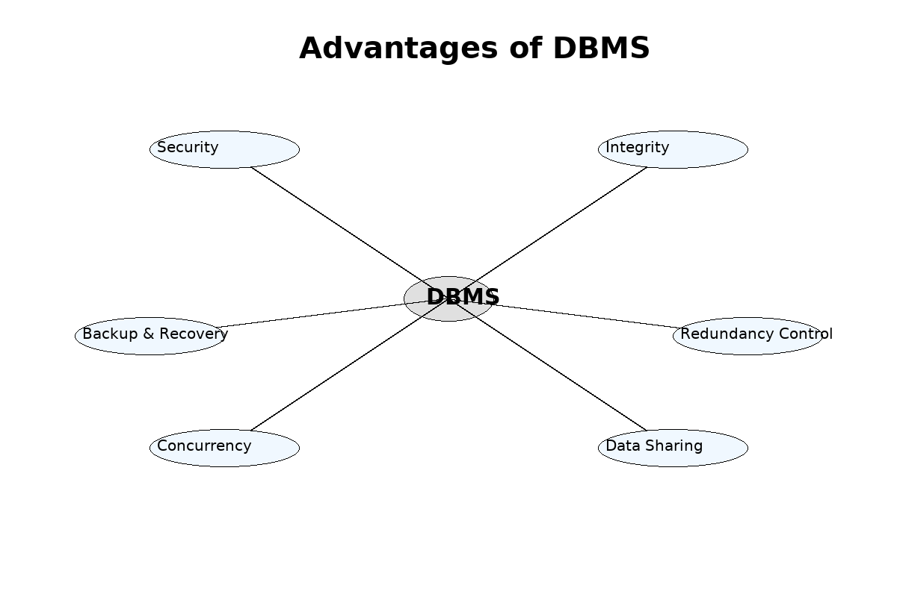

# 📚 Database Course Documentation

## 1. Flat File Systems vs. Relational Databases – Comparison

| Feature             | Flat File System                                      | Relational Database (RDBMS)                          |
|---------------------|-------------------------------------------------------|------------------------------------------------------|
| **Structure**       | Simple text files without a defined schema            | Organized into tables with a defined schema          |
| **Data Redundancy** | High – duplicate data is common                       | Low – data is normalized to reduce repetition        |
| **Relationships**   | No support for data relationships                     | Supports relationships using foreign keys            |
| **Example Usage**   | CSV files, Excel spreadsheets                         | MySQL, PostgreSQL, Oracle                            |
| **Drawbacks**       | Hard to scale, query, or manage                       | Requires setup and has a learning curve              |

---

## 2. 🧠 Advantages of DBMS – Mind Map

### Key Benefits:
- **Security** – Role-based access control and user permissions  
- **Integrity** – Ensures data accuracy and consistency  
- **Backup & Recovery** – Regular backups minimize data loss  
- **Redundancy Control** – Minimizes duplicate data storage  
- **Concurrency** – Allows multiple users to access data safely  
- **Data Sharing** – Enables data sharing across applications and users  

---

## 3. 👥 Roles in a Database System

| Role                      | Responsibility                                                              |
|---------------------------|------------------------------------------------------------------------------|
| **System Analyst**        | Defines system requirements and bridges users with developers                |
| **Database Designer**     | Plans and structures the logical/physical design of the database             |
| **Database Developer**    | Writes SQL code to create and populate databases                             |
| **Database Administrator**| Ensures performance, security, backup, and tuning of the database            |
| **Application Developer** | Builds applications that interact with the database                          |
| **BI Developer**          | Designs reports, dashboards, and data models for business intelligence       |

---

## 4. 📂 Types of Databases

### A. Relational vs. Non-Relational

| Type             | Description                                  | Examples                    |
|------------------|----------------------------------------------|-----------------------------|
| **Relational**    | Structured, table-based, schema-driven       | MySQL, Oracle, SQL Server   |
| **Non-Relational**| Schema-less, supports unstructured data      | MongoDB, Cassandra          |

### B. Centralized vs. Distributed vs. Cloud

| Type          | Description                                        | Use Case Example                 |
|---------------|----------------------------------------------------|----------------------------------|
| **Centralized**| Single location stores all data                   | Local inventory system           |
| **Distributed**| Data stored across multiple systems               | Global platforms like Netflix    |
| **Cloud**      | Cloud-hosted and managed infrastructure           | Amazon RDS for e-commerce apps   |

---

## 5. ☁️ Cloud Storage and Databases

### What is Cloud Storage?
Cloud storage refers to saving data on remote servers accessed through the internet, often managed by third-party providers like **AWS**, **Azure**, or **Google Cloud**.

### How It Supports Databases:
- Automatically scalable storage
- Easy integration with managed DB services
- Enables global data access and real-time backups

### ✅ Advantages:
- Auto-scaling
- Lower startup costs
- No physical infrastructure required
- Built-in high availability and disaster recovery

### ⚠️ Challenges:
- Requires internet connection
- Possible data breach risks if unsecured
- Cost increases with usage
- May have legal/compliance limitations

---

## ✅ Submission Checklist

- [x] GitHub repo created and named Database Course Documentation
- [x] README.md file added
- [x] All five sections included and explained
- [x] Mind map image (mindmap.png) uploaded and embedded
- [x] Clear headings, tables, and visuals used
- [x] Original wording used throughout the document
